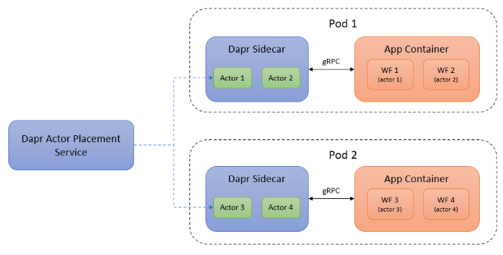
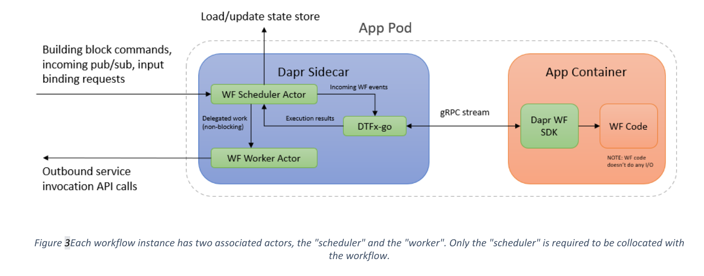

# Title of proposal 

* Author(s): John Ewart, Chris Gillum
* State: Ready for Implementation
* Updated: 11/01/2022

# Overview

This document proposes that the Dapr runtime be extended to include a new workflow building block. This building block, in combination with a lightweight, portable, workflow engine will enable developers to express workflows as code that can be executed, interacted with, monitored, and debugged using the Dapr runtime.

# Background

Many complex business processes are well modeled as a workflow - a set of steps needing to be orchestrated that require resiliency and guarantee completion (success or failure are both completions). To build such workflows, developers are often faced with needing to solve a host of complex problems, including (but not limited to):

* Scheduling
* Lifecycle management
* State storage
* Monitoring and debugging
* Resiliency
* Failure handling mechanisms

Based on available data, it is clear that workflows are quite popular; at the time of this writing, the number of daily executions for hosted workflows and their tasks is in the billions per day across tens of thousands of Azure subscriptions.

## What is a workflow?

A workflow, for the purpose of this proposal, is defined as application logic that defines a business process or data flow that:

* Has a specific, pre-defined, deterministic lifecycle (e.g Pending -> Running -> [Completed | Failed | Terminated])
* Is guaranteed to complete
* Is durable (i.e completion in the face of transient errors)
* Can be scheduled to start or execute steps at or after some future time
* Can be paused and resumed (explicitly or implicitly)
* Can execute portions of the workflow in serial or parallel
* Can be directly addressed by external agents (i.e an instance of the workflow can be interacted with directly - paused, resumed, queried, etc.)
* May be versioned
* May be stateful
* May create new sub-workflows and optionally wait for those to complete before progressing
* May rely on external components to perform its job (i.e HTTPS API calls, pub/sub message queues, etc.)

## Why Dapr?

Dapr already contains many of the building blocks required to provide reliability, scalability, and durability to the execution of workflows. Building such an engine inside Dapr, and providing the necessary building blocks will help to increase developer productivity through re-usability of existing features and independence from the underlying execution mechanism thereby increasing portability.

In addition to the built-in execution engine, Dapr can provide a consistent programming interface for interacting with third-party workflow execution systems (i.e AWS SWF, Apache Camel, Drools) for those who are already using these tools. Thereby providing a standardized interface for working with both external workflows as well as those running inside Dapr.

# Related Items

## Related proposals 

Links to proposals that are related to this (either due to dependency, or possibly because this will replace another proposal)

## Related issues 

Please link to any issues that this proposal is related to, for example, are there existing bugs filed in various Dapr repositories that this will affect?


# Analysis

## High-level overview of changes

We propose that the following features / capabilities be added to the Dapr runtime:

* A new "workflow" building block
* A portable, lightweight, workflow engine embedded into the Dapr sidecar capable of supporting long-running, resilient, and durable workflows through Dapr's building blocks
* An expressive, developer-friendly, programming model for building workflows as code
* Support for containerized, declarative, workflows (such as the CNCF Serverless Workflow specification)
* Extensions to the Dapr dashboard for monitoring / managing workflow execution
* APIs for interacting with workflows


# Implementation

As mentioned before, this proposal includes the addition of a new workflow building block. Like most of the other Dapr building blocks (state stores, pubsub, etc.) the workflow building block will consist of two primary things:

* A pluggable component model for integrating various workflow engines
* A set of APIs for managing workflows (start, schedule, pause, resume, cancel)

Similar to the built-in support for actors, we also propose implementing a built-in runtime for workflows (see the DTFx-go engine described in the next section). Unlike actors, the workflow runtime component can be swapped out with an alternate implementation. If developers want to work with other workflow engines, such as externally hosted workflow services like Azure Logic Apps, AWS Step Functions, or Temporal.io, they can do so with alternate community-contributed workflow components.

The value of this building block for vendors is that workflows supported by their platforms can be exposed as APIs with support for HTTP and the Dapr SDKs. The less visible but benefits of mTLS, distributed tracing, etc. will also be available. Various abstractions, such as async HTTP polling, can also be supported via Dapr without the workflow vendor needing to implement it themselves.

## Introducing DTFx-go

We propose adding a lightweight, portable, embedded workflow engine (DTFx-go) in the Dapr sidecar that leverages existing Dapr components, including actors and state storage, in its underlying implementation. By being lightweight and portable developers will be able to execute workflows that run inside DFTx-go locally as well as in production with minimal overhead; this enhances the developer experience by integrating workflows with the existing Dapr development model that users enjoy.

The new engine will be written in Go and inspired by the existing Durable Task Framework (DTFx) engine. We’ll call this new version of the framework DTFx-go to distinguish it from the .NET implementation (which is not part of this proposal) and it will exist as an open-source project with a permissive, e.g., Apache 2.0, license so that it remains compatible as a dependency for CNCF projects. Note that it’s important to ensure this engine remains lightweight so as not to noticeably increase the size of the Dapr sidecar.

Importantly, DTFx-go will not be exposed to the application layer. Rather, the Dapr sidecar will expose DTFx-go functionality over a gRPC stream. The Dapr sidecar will not execute any app-specific workflow logic or load any declarative workflow documents. Instead, app containers will be responsible for hosting the actual workflow logic. The Dapr sidecar can send and receive workflow commands over gRPC to and from connected app’s workflow logic, execute commands on behalf of the workflow (service invocation, invoking bindings, etc.). Other concerns such as activation, scale-out, and state persistence will be handled by internally managed actors. More details on all of this will be discussed in subsequent sections.

## Execution, scheduling and resilience

Internally, Dapr workflow instances will be implemented as actors. Actors drive workflow execution by communicating with the workflow SDK over a gRPC stream. By using actors, the problem of placement and scalability are already solved for us.



The execution of individual workflows will be triggered using actor reminders as they are both persistent and durable (two critical features of workflows). If a container or node crashes during a workflow’s execution, the actor’s reminder will ensure it gets activated again and resumes where it left off (using state storage to provide durability, see below).

To prevent a workflow from blocking (unintentionally) each workflow will be composed of two separate actor components, one acting as the scheduler / coordinator and the other performing the actual work (calling API services, performing computation, etc.).



## Storage of state and durability

In order for a workflow execution to reliably complete in the face of transient errors, it must be durable -- meaning that it is able to store data at checkpoints as it makes progress. To achieve this, workflow executions will rely on Dapr's state storage to provide stable storage such that the workflow can be safely resumed from a known-state in the event that it is explicitly paused or a step is prematurely terminated (system failure, lack of resources, etc.).

## Workflows as code

The term "workflow as code" refers to the implementation of a workflow’s logic using general purpose programming languages. "Workflow as code" is used in a growing number of modern workflow frameworks, such as Azure Durable Functions, Temporal.io, and Prefect (Orion). The advantage of this approach is its developer-friendliness. Developers can use a programming language that they already know (no need to learn a new DSL or YAML schema), they have access to the language’s standard libraries, can build their own libraries and abstractions, can use debuggers and examine local variables, and can even write unit tests for their workflows just like they would any other part of their application logic.

The Dapr SDK will internally communicate with the DTFx-go gRPC endpoint in the Dapr sidecar to receive new workflow events and send new workflow commands, but these protocol details will be hidden from the developer. Due to the complexities of the workflow protocol, we are not proposing any HTTP API for the runtime aspect of this feature.

## Support for declarative workflows

We expect workflows as code to be very popular for developers because working with code is both very natural for developers and is much more expressive and flexible compared to declarative workflow modeling languages. In spite of this, there will still be users who will prefer or require workflows to be declarative. To support this, we propose building an experience for declarative workflows as a layer on top of the "workflow as code" foundation. A variety of declarative workflows could be supported in this way. For example, this model could be used to support the AWS Step Functions workflow syntax, the Azure Logic Apps workflow syntax, or even the Google Cloud Workflow syntax. However, for the purpose of this proposal, we’ll focus on what it would look like to support the CNCF Serverless Workflow specification. Note, however, that the proposed model could be used to support any number of declarative multiple workflow schemas.

### CNCF Serverless Workflows

Serverless Workflow (SLWF) consists of an open-source standards-based DSL and dev tools for authoring and validating workflows in either JSON or YAML. SLWF was specifically selected for this proposal because it represents a cloud native and industry standard way to author workflows. There are a set of already existing open-source tools for generating and validating these workflows that can be adopted by the community. It’s also an ideal fit for Dapr since it’s under the CNCF umbrella (currently as a sandbox project). This proposal would support the SLWF project by providing it with a lightweight, portable runtime – i.e., the Dapr sidecar.

### Hosting Serverless Workflows

In this proposal, we use the Dapr SDKs to build a new, portable SLWF runtime that leverages the Dapr sidecar. Most likely it is implemented as a reusable container image and supports loading workflow definition files from Dapr state stores (the exact details need to be worked out). Note that the Dapr sidecar doesn’t load any workflow definitions. Rather, the sidecar simply drives the execution of the workflows, leaving all other details to the application layer.

## API 

Terms used in the API:

* Workflow Type - the type of workflow to be executed (i.e a registered workflow name)
* Instance ID - a unique identifier for the execution instance

### Start Workflow 

Inputs:
 * Workflow Type
 * Instance ID

Results:

* Success: Sufficient information to get the status of the execution 
* Failure: Error data indicating why the failure occurred 

Workflows are assumed to have a type that is identified by the "workflow type" parameter. Each workflow instance must also be created with a unique instance ID value. The payload of the request is the input of the workflow to be passed to the workflow.

### Terminate Workflow

Inputs:

* Workflow Type
* Instance ID 

Results:

* Failure: Error data indicating why the workflow was unable to be terminated (missing data, doesn't exist, connectivity issue, etc.) 

Workflow termination is primarily an operation that a service operator takes if a particular business process needs to be cancelled, or if a problem with the workflow requires it to be stopped to mitigate impact to other services.


### Raise Event 

Workflows are especially useful when they can wait for and be driven by external events. For example, a workflow could subscribe to events from a pubsub topic as shown in the Phone Verification sample. However, this capability shouldn’t be limited to pub/sub events and, as such there should be a callback mechanism available to supply a workflow with input. 

Inputs:
 * Workflow type
 * Instance ID
 * Message to be delivered to workflow (opaque data)

Results:
 * Failure: Error data indicating why this operation was unsuccessful


### Get workflow metadata API

This API will allow querying of a workflow in the system, this is used to get the status or other metadata about a workflow. 

Inputs

 * Workflow type
 * Instance ID

Results

Success:

  * Start time
  * Runtime status (pending, started, completed, canceled, aborted)
  * Workflow result (output of workflow if completed, error information or other message otherwise)
  * Input data supplied to workflow

Failure:
  * Error code and information regarding failure of the API call

### Purge workflow metadata API

Users can delete all state associated with a workflow using the purge workflow API call

Inputs

 * Workflow type
 * Instance ID

Results

Failure:
  * Error code and information regarding failure of the API call

  
## HTTP API 

"Normal" error codes and reasons are expected as part of the failure responses for these endpoints (400 on client error, 404 if does not exist, etc.). Endpoint-specific response data is included below. 

### Start Workflow 

```POST http://localhost:3500/v1.0/workflows/{workflowType}/{instanceId}/start```

> The body of the POST request is the input (as an opaque blob passed) to be passed to the workflow. 

#### Failure responses

* `409` -- a workflow instance with this ID already exists
* `400` -- incorrect inputs (e.g. workflow type does not exist)

#### Success responses

* `202` -- workflow was successfully started 
   * Location set to URL of status endpoint to support asynchronous status checking by the client

### Terminate Workflow 

```POST http://localhost:3500/v1.0/workflows/{workflowType}/{instanceId}/terminate```

> The body of the POST request should be saved as the output of the workflow instance (i.e the reason for termination)

#### Success responses
* `200` -- workflow successfully terminated

### Raise Event API

```POST http://localhost:3500/v1.0/workflows/{workflowType}/{instanceId}/raiseEvent```

#### Success responses:

 * `202` -- indicates that the event was received (and persisted to ensure delivery) but possibly not yet processed.

### Get workflow metadata 


```GET http://localhost:3500/v1.0/workflows/{workflowType}/{instanceId}```


### Purge workflow metadata

```DELETE http://localhost:3500/v1.0/workflows/{workflowType}/{instanceId}```


## gRPC

### Common structs

```
message WorkflowInstance {
    string WorkflowType = 1; 
    string InstanceID = 2; 
}
```

### Start Workflow 

```proto

rpc StartWorkflow (StartWorkflowRequest) returns (StartWorkflowResponse) {}

enum WorkflowStatus {
    WORKFLOW_CREATED = 0;
    WORKFLOW_STARTED = 1; 
    WORKFLOW_ERROR = 2; 
    WORKFLOW_CANCELLED = 3; 
    WORKFLOW_COMPLETED = 4; 
}

message StartWorkflowRequest {
    WorkflowInstance Instance = 1; 
    bytes WorkflowInput = 2; 
}

message StartWorkflowResponse {
   WorkflowInstance Instance = 1; 
   WorkflowStatus Status = 2; 
   string Message = 3; 
}
```

### Terminate Workflow 

```
rpc StopWorkflow(StopWorkflowRequest) returns (StopWorkflowResponse) {}

message StopWorkflowRequest {
    WorkflowInstance Instance = 1; 
    bytes Payload = 2; 
}

message StopWorkflowResponse {
    WorkflowInstance Instance = 1; 
    WorkflowStatus Status = 2;
    string Message = 3; 
}
```


### Raise Event API


```

rpc RaiseWorkflowEvent(WorkflowEventMessage) returns (Empty) {}

message WorkflowEventMessage {
    WorkflowInstance Instance = 1; 
    bytes Payload = 3;
}
```


### Get workflow metadata 

```
rpc GetWorkflowMetadata(WorkflowMetadataRequest) returns (WorkflowMetadataResponse) {}

message WorkflowMetadataRequest {
    WorkflowInstance Instance = 1; 
}

message WorkflowMetadataResponse {
    WorkflowInstance Instance = 1; 
    WorkflowStatus Status = 2; 
    bytes Result = 3; 
    Timestamp StartTime = 4; 
    Timestamp EndTime = 5; 
}

```

### Purge workflow metadata

```
rpc PurgeWorkflowMetadata(PurgeWorkflowMetadataRequest) returns (Empty) {}

message PurgeWorkflowMetadataRequest {
    WorkflowInstance Instance = 1;
}
```

## Other 

### Input bindings

For certain types of automation scenarios, it can be useful to trigger new instances of workflows directly from Dapr input bindings. For example, it may be useful to trigger a workflow in response to a tweet from a particular user account using the Twitter input binding. Another example is starting a new workflow in response to a Kubernetes event, like a deployment creation event.

The instance ID and input payload for the workflow depends on the configuration of the input binding. For example, a user may want to use a Tweet’s unique ID or the name of the Kubernetes deployment as the instance ID.

### Pub/Sub

Workflows can also be started directly from pub/sub events, similar to the proposal for Actor pub/sub. Configuration on the pub/sub topic can be used to identify an appropriate instance ID and input payload to use for initializing the workflow. In the simplest case, the source + ID of the cloud event message can be used as the workflow’s instance ID.


### Programmatic workflows

#### Example 1: Bank transaction

In this example, the workflow is implemented as a JavaScript generator function. The "bank1" and "bank2" parameters are Microservice apps that use Dapr, each of which expose "withdraw" and "deposit" APIs. The Dapr APIs available to the workflow come from the context parameter object and return a "task" which effectively the same as a Promise. Calling yield on the task causes the workflow to durably checkpoint its progress and wait until Dapr responds with the output of the service method. The value of the task is the service invocation result. If any service method call fails with an error, the error is surfaced as a raised JavaScript error that can be caught using normal try/catch syntax. This code can also be debugged using a Node.js debugger.

Note that the details around how code is written will vary depending on the language. For example, a C# SDK would allow developers to use async/await instead of yield. Regardless of the language details, the core capabilities will be the same across all languages.

```javascript
import { DaprWorkflowClient, DaprWorkflowContext, HttpMethod } from "dapr-client"; 

const daprHost = process.env.DAPR_HOST || "127.0.0.1"; // Dapr sidecar host 

const daprPort = process.env.DAPR_WF_PORT || "50001";  // Dapr sidecar port for workflow 

const workflowClient = new DaprWorkflowClient(daprHost, daprPort); 

// Funds transfer workflow which receives a context object from Dapr and an input 
workflowClient.addWorkflow('transfer-funds-workflow', function*(context: DaprWorkflowContext, op: any) { 
    // use built-in methods for generating psuedo-random data in a workflow-safe way 
    const transactionId = context.createV5uuid(); 

    // try to withdraw funds from the source account. 
    const success = yield context.invoker.invoke("bank1", "withdraw", HttpMethod.POST, { 
        srcAccount: op.srcAccount, 
        amount: op.amount, 
        transactionId 
    }); 

    if (!success.success) { 
        return "Insufficient funds"; 
    } 

    try { 
        // attempt to deposit into the dest account, which is part of a separate microservice app 
        yield context.invoker.invoke("bank2", "deposit", HttpMethod.POST, {
            destAccount: op.destAccount, 
            amount: op.amount, 
            transactionId 
        }); 
        return "success"; 
    } catch { 
        // compensate for failures by returning the funds to the original account 
        yield context.invoker.invoke("bank1", "deposit", HttpMethod.POST, { 
            destAccount: op.srcAccount, 
            amount: op.amount, 
            transactionId 
        }); 
        return "failure"; 
    } 
}); 

// Call start() to start processing workflow events 
workflowClient.start(); 
```


#### Example 2: Phone Verification

Here’s another sample that shows how a developer might build an SMS phone verification workflow. The workflow receives some user’s phone number, creates a challenge code, delivers the challenge code to the user’s SMS number, and waits for the user to respond with the correct challenge code.

The important takeaway is that the end-to-end workflow can be represented as a single, easy-to-understand function. Rather than relying directly on actors to hold state explicitly, state (such as the challenge code) can simply be stored in local variables, drastically reducing the overall code complexity and making the solution easily unit testable.

```javascript
import { DaprWorkflowClient, DaprWorkflowContext, HttpMethod } from "dapr-client"; 

const daprHost = process.env.DAPR_HOST || "127.0.0.1"; // Dapr sidecar host 
const daprPort = process.env.DAPR_WF_PORT || "50001";  // Dapr sidecar port for workflow 
const workflowClient = new DaprWorkflowClient(daprHost, daprPort); 

// Phone number verification workflow which receives a context object from Dapr and an input 
workflowClient.addWorkflow('phone-verification', function*(context: DaprWorkflowContext, phoneNumber: string) { 

    // Create a challenge code and send a notification to the user's phone 
    const challengeCode = yield context.invoker.invoke("authService", "createSmsChallenge", HttpMethod.POST, { 
        phoneNumber 
    }); 

    // Schedule a durable timer for some future date (e.g. 5 minutes or perhaps even 24 hours from now) 
    const expirationTimer = context.createTimer(challengeCode.expiration); 

    // The user gets three tries to respond with the right challenge code 
    let authenticated = false; 

    for (let i = 0; i <= 3; i++) { 
        // subscribe to the event representing the user challenge response 
        const responseTask = context.pubsub.subscribeOnce("my-pubsub-component", "sms-challenge-topic"); 

        // block the workflow until either the timeout expires or we get a response event 
        const winner = yield context.whenAny([expirationTimer, responseTask]); 

        if (winner === expirationTimer) { 
            break; // timeout expired 
        } 

        // we get a pubsub event with the user's SMS challenge response 
        if (responseTask.result.data.challengeNumber === challengeCode.number) { 
            authenticated = true; // challenge verified! 
            expirationTimer.cancel(); 
            break; 
        } 
    } 

    // the return value is available as part of the workflow status. Alternatively, we could send a notification. 
    return authenticated; 
}); 

// Call listen() to start processing workflow events 
workflowClient.listen(); 
```

#### Example 3: Declarative workflow for monitoring patient vitals

The following is an example of a very simple SLWF workflow definition that listens on three different event types and invokes a function depending on which event was received.

```
{ 
    "id": "monitorPatientVitalsWorkflow", 
    "version": "1.0", 
    "name": "Monitor Patient Vitals Workflow", 
    "states": [ 
      { 
        "name": "Monitor Vitals", 
        "type": "event", 
        "onEvents": [ 
          { 
            "eventRefs": [ 
              "High Body Temp Event", 
              "High Blood Pressure Event" 
            ], 
            "actions": [{"functionRef": "Invoke Dispatch Nurse Function"}] 
          }, 
          { 
            "eventRefs": ["High Respiration Rate Event"], 
            "actions": [{"functionRef": "Invoke Dispatch Pulmonologist Function"}] 
          } 
        ], 
        "end": true 
      } 
    ], 
    "functions": "file://my/services/asyncapipatientservicedefs.json", 
    "events": "file://my/events/patientcloudeventsdefs.yml" 
} 
```

The functions defined in this workflow would map to Dapr service invocation calls. Similarly, the events would map to incoming Dapr pub/sub events. Behind the scenes, the runtime (which is built using the Dapr SDK APIs mentioned previously) handles the communication with the Dapr sidecar, which in turn manages the checkpointing of state and recovery semantics for the workflows.


